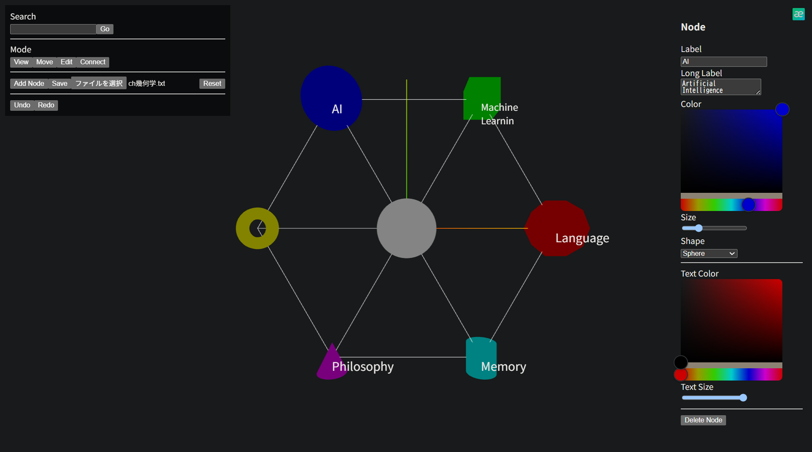
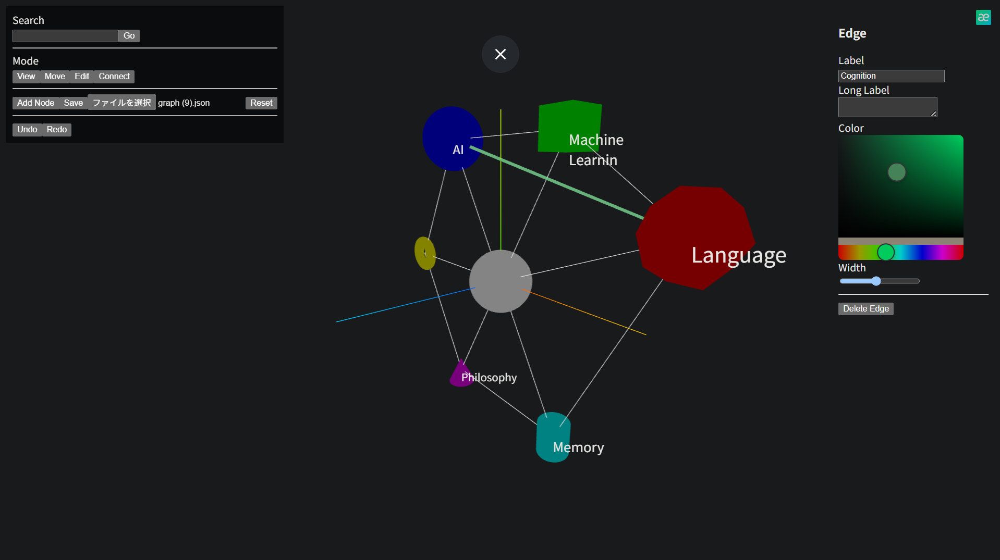

# Thought Space

A 3D concept mapping tool for visualizing ideas, knowledge, and relationships.

Demo:
https://thought-space-5xst.vercel.app/

## Overview

Thought Space is an interactive application that allows users to organize concepts in a 3D space.

Unlike traditional 2D mind maps, Thought Space represents ideas as nodes and relationships as edges in a three-dimensional environment.

Users can manually place concepts and create their own thought structures.

## Features

### 3D Concept Visualization

Create concepts as nodes and arrange them freely in 3D space.

### Relationship Mapping

Connect concepts with edges to represent relationships.

The distance between nodes represents the user's interpretation of conceptual distance.

### Node Customization

Each node can be customized:

- Label
- Description
- Color
- Shape
- Size

### Graph Management

- Save graphs as JSON
- Load previous graphs
- Undo / Redo history

## Screenshots

### Main View

### Edit Mode

### Knowledge Map

## Tech Stack

Frontend:

- React
- TypeScript
- Vite

3D:

- Three.js
- React Three Fiber
- React Three Drei

## Project Structure

src/
├── components/
├── hooks/
├── utils/
└── main.tsx

## Future Development

Possible future features:

- AI-assisted concept generation
- Knowledge extraction from documents
- Automatic concept clustering
- Collaborative editing

## Purpose

Thought Space aims to provide a spatial environment for:

- Thinking
- Knowledge organization
- Idea exploration
- Concept visualization

## License

MIT
